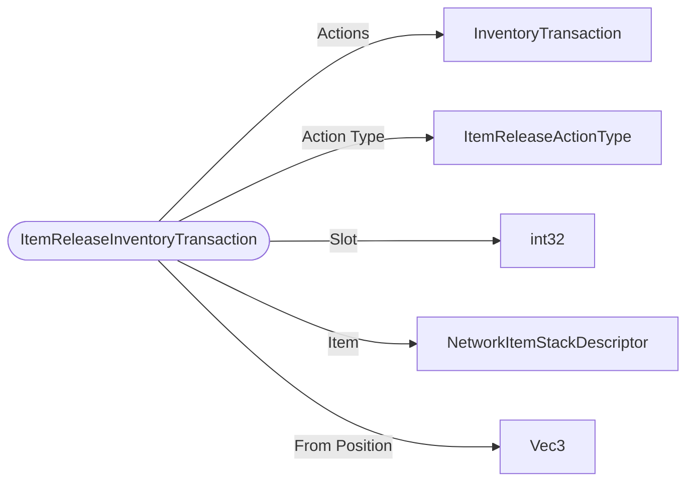

# ItemReleaseInventoryTransaction

`struct`

```mermaid
flowchart LR
  ROOT(["ItemReleaseInventoryTransaction"])
  ROOT -->|"Actions"| InventoryTransaction["InventoryTransaction"]
  ROOT -->|"Action Type"| ItemReleaseActionType["ItemReleaseActionType"]
  ROOT -->|"Slot"| int32["int32"]
  ROOT -->|"Item"| NetworkItemStackDescriptor["NetworkItemStackDescriptor"]
  ROOT -->|"From Position"| Vec3["Vec3"]
```

