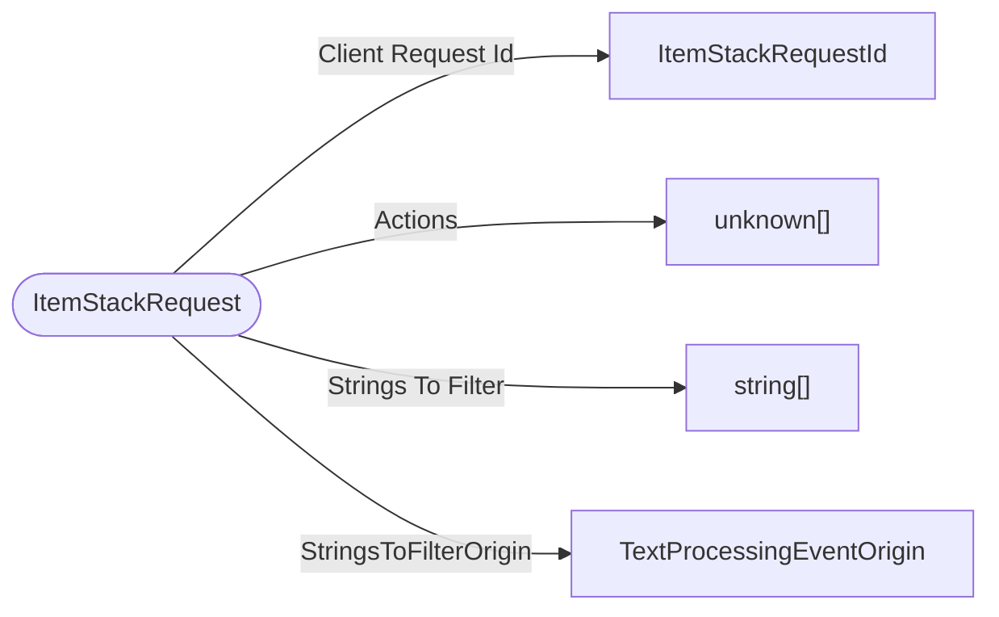

# ItemStackRequest

`struct`

```mermaid
flowchart LR
  ROOT(["ItemStackRequest"])
  ROOT -->|"Client Request Id"| ItemStackRequestId["ItemStackRequestId"]
  ROOT -->|"Actions"| unknown["unknown[]"]
  ROOT -->|"Strings To Filter"| string["string[]"]
  ROOT -->|"StringsToFilterOrigin"| TextProcessingEventOrigin["TextProcessingEventOrigin"]
```

