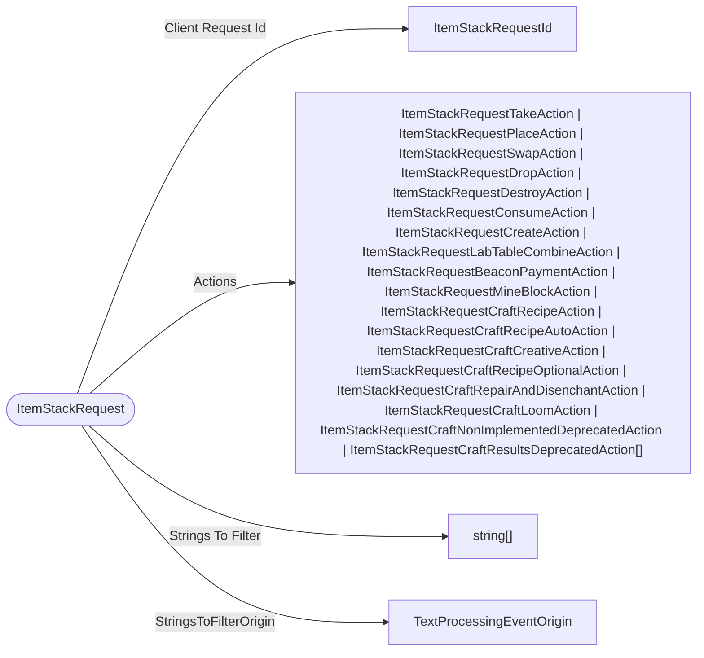

# ItemStackRequest

`struct`

```mermaid
flowchart LR
  ROOT(["ItemStackRequest"])
  ROOT -->|"Client Request Id"| ItemStackRequestId["ItemStackRequestId"]
  ROOT -->|"Actions"| ItemStackRequestTakeAction___ItemStackRequestPlaceAction___ItemStackRequestSwapAction___ItemStackRequestDropAction___ItemStackRequestDestroyAction___ItemStackRequestConsumeAction___ItemStackRequestCreateAction___ItemStackRequestLabTableCombineAction___ItemStackRequestBeaconPaymentAction___ItemStackRequestMineBlockAction___ItemStackRequestCraftRecipeAction___ItemStackRequestCraftRecipeAutoAction___ItemStackRequestCraftCreativeAction___ItemStackRequestCraftRecipeOptionalAction___ItemStackRequestCraftRepairAndDisenchantAction___ItemStackRequestCraftLoomAction___ItemStackRequestCraftNonImplementedDeprecatedAction___ItemStackRequestCraftResultsDeprecatedAction["ItemStackRequestTakeAction | ItemStackRequestPlaceAction | ItemStackRequestSwapAction | ItemStackRequestDropAction | ItemStackRequestDestroyAction | ItemStackRequestConsumeAction | ItemStackRequestCreateAction | ItemStackRequestLabTableCombineAction | ItemStackRequestBeaconPaymentAction | ItemStackRequestMineBlockAction | ItemStackRequestCraftRecipeAction | ItemStackRequestCraftRecipeAutoAction | ItemStackRequestCraftCreativeAction | ItemStackRequestCraftRecipeOptionalAction | ItemStackRequestCraftRepairAndDisenchantAction | ItemStackRequestCraftLoomAction | ItemStackRequestCraftNonImplementedDeprecatedAction | ItemStackRequestCraftResultsDeprecatedAction[]"]
  ROOT -->|"Strings To Filter"| string["string[]"]
  ROOT -->|"StringsToFilterOrigin"| TextProcessingEventOrigin["TextProcessingEventOrigin"]
```

