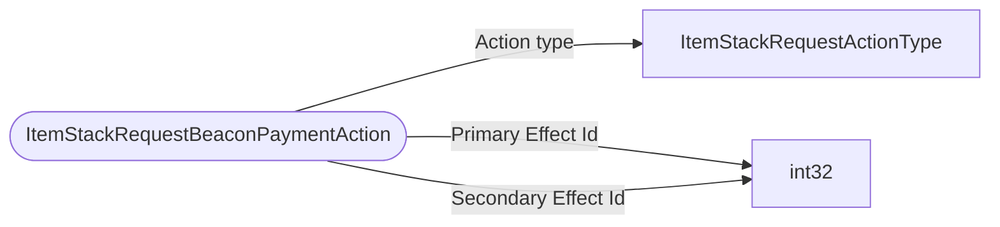

# ItemStackRequestBeaconPaymentAction

`struct`

```mermaid
flowchart LR
  ROOT(["ItemStackRequestBeaconPaymentAction"])
  ROOT -->|"Action type"| ItemStackRequestActionType["ItemStackRequestActionType"]
  ROOT -->|"Primary Effect Id"| int32["int32"]
  ROOT -->|"Secondary Effect Id"| int32["int32"]
```

