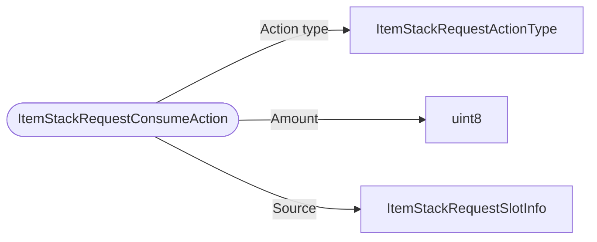

# ItemStackRequestConsumeAction

`struct`

```mermaid
flowchart LR
  ROOT(["ItemStackRequestConsumeAction"])
  ROOT -->|"Action type"| ItemStackRequestActionType["ItemStackRequestActionType"]
  ROOT -->|"Amount"| uint8["uint8"]
  ROOT -->|"Source"| ItemStackRequestSlotInfo["ItemStackRequestSlotInfo"]
```

