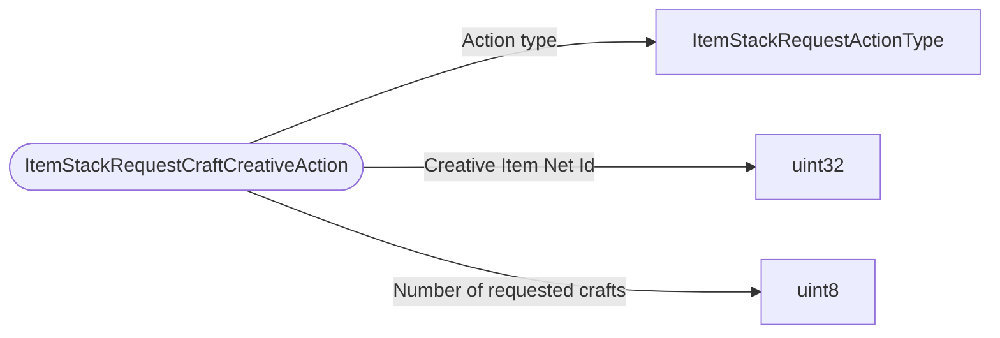

# ItemStackRequestCraftCreativeAction

`struct`

```mermaid
flowchart LR
  ROOT(["ItemStackRequestCraftCreativeAction"])
  ROOT -->|"Action type"| ItemStackRequestActionType["ItemStackRequestActionType"]
  ROOT -->|"Creative Item Net Id"| uint32["uint32"]
  ROOT -->|"Number of requested crafts"| uint8["uint8"]
```

