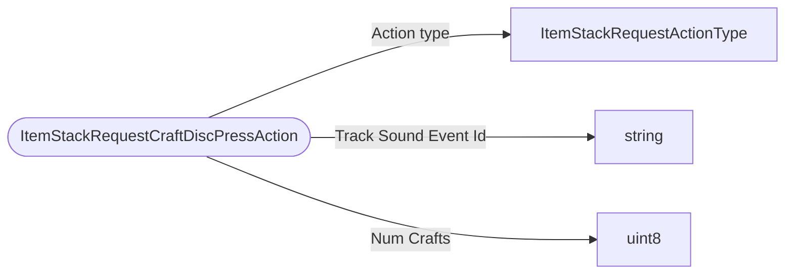

# ItemStackRequestCraftDiscPressAction

`struct`

```mermaid
flowchart LR
  ROOT(["ItemStackRequestCraftDiscPressAction"])
  ROOT -->|"Action type"| ItemStackRequestActionType["ItemStackRequestActionType"]
  ROOT -->|"Track Sound Event Id"| string["string"]
  ROOT -->|"Num Crafts"| uint8["uint8"]
```

