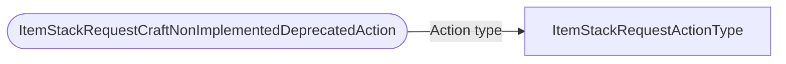

# ItemStackRequestCraftNonImplementedDeprecatedAction

`struct`

```mermaid
flowchart LR
  ROOT(["ItemStackRequestCraftNonImplementedDeprecatedAction"])
  ROOT -->|"Action type"| ItemStackRequestActionType["ItemStackRequestActionType"]
```

