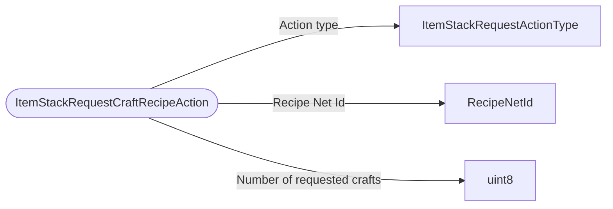

# ItemStackRequestCraftRecipeAction

`struct`

```mermaid
flowchart LR
  ROOT(["ItemStackRequestCraftRecipeAction"])
  ROOT -->|"Action type"| ItemStackRequestActionType["ItemStackRequestActionType"]
  ROOT -->|"Recipe Net Id"| RecipeNetId["RecipeNetId"]
  ROOT -->|"Number of requested crafts"| uint8["uint8"]
```

