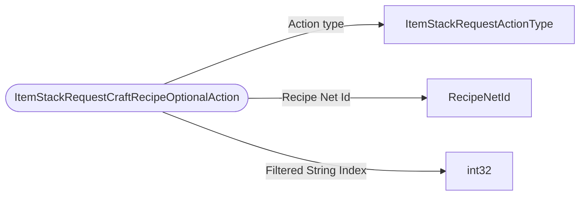

# ItemStackRequestCraftRecipeOptionalAction

`struct`

```mermaid
flowchart LR
  ROOT(["ItemStackRequestCraftRecipeOptionalAction"])
  ROOT -->|"Action type"| ItemStackRequestActionType["ItemStackRequestActionType"]
  ROOT -->|"Recipe Net Id"| RecipeNetId["RecipeNetId"]
  ROOT -->|"Filtered String Index"| int32["int32"]
```

