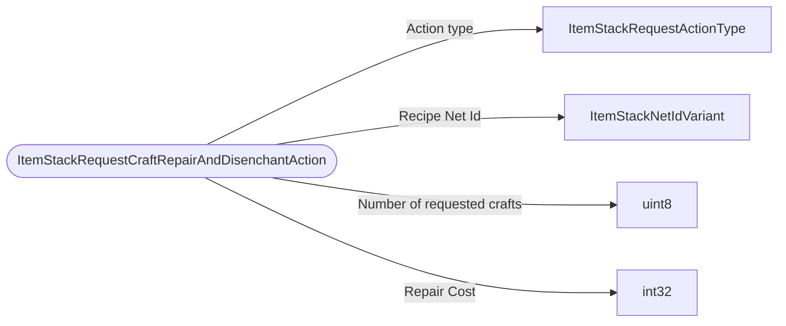

# ItemStackRequestCraftRepairAndDisenchantAction

`struct`

```mermaid
flowchart LR
  ROOT(["ItemStackRequestCraftRepairAndDisenchantAction"])
  ROOT -->|"Action type"| ItemStackRequestActionType["ItemStackRequestActionType"]
  ROOT -->|"Recipe Net Id"| ItemStackNetIdVariant["ItemStackNetIdVariant"]
  ROOT -->|"Number of requested crafts"| uint8["uint8"]
  ROOT -->|"Repair Cost"| int32["int32"]
```

