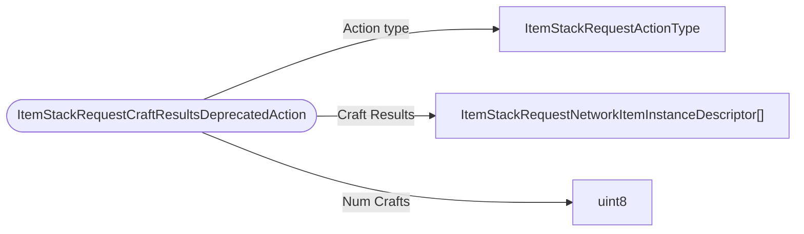

# ItemStackRequestCraftResultsDeprecatedAction

`struct`

- protocol: 2168
- minecraft: 1.26.40

```mermaid
flowchart LR
  ROOT(["ItemStackRequestCraftResultsDeprecatedAction"])
  ROOT -->|"Action type"| ItemStackRequestActionType["ItemStackRequestActionType"]
  ROOT -->|"Craft Results"| ItemStackRequestNetworkItemInstanceDescriptor["ItemStackRequestNetworkItemInstanceDescriptor[]"]
  ROOT -->|"Num Crafts"| uint8["uint8"]
```

