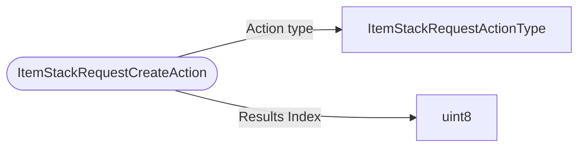

# ItemStackRequestCreateAction

`struct`

```mermaid
flowchart LR
  ROOT(["ItemStackRequestCreateAction"])
  ROOT -->|"Action type"| ItemStackRequestActionType["ItemStackRequestActionType"]
  ROOT -->|"Results Index"| uint8["uint8"]
```

