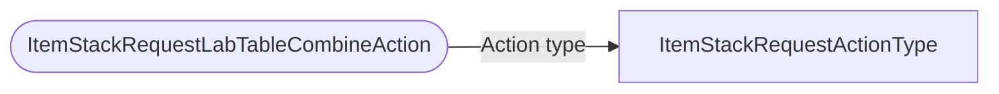

# ItemStackRequestLabTableCombineAction

`struct`

```mermaid
flowchart LR
  ROOT(["ItemStackRequestLabTableCombineAction"])
  ROOT -->|"Action type"| ItemStackRequestActionType["ItemStackRequestActionType"]
```

