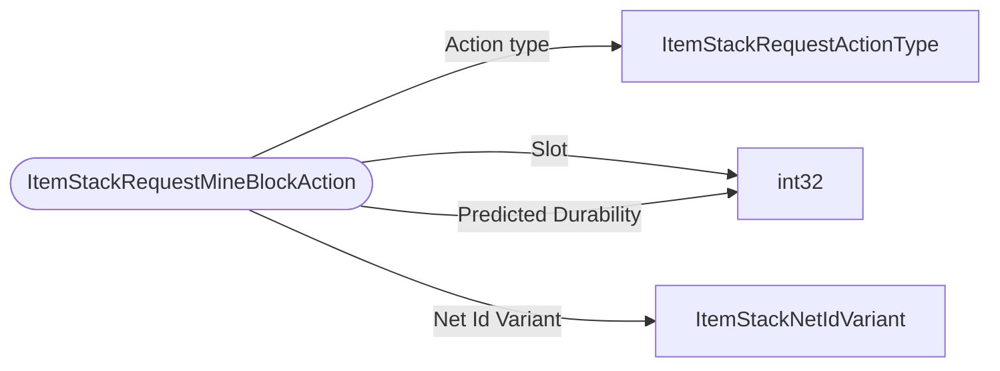

# ItemStackRequestMineBlockAction

`struct`

```mermaid
flowchart LR
  ROOT(["ItemStackRequestMineBlockAction"])
  ROOT -->|"Action type"| ItemStackRequestActionType["ItemStackRequestActionType"]
  ROOT -->|"Slot"| int32["int32"]
  ROOT -->|"Predicted Durability"| int32["int32"]
  ROOT -->|"Net Id Variant"| ItemStackNetIdVariant["ItemStackNetIdVariant"]
```

