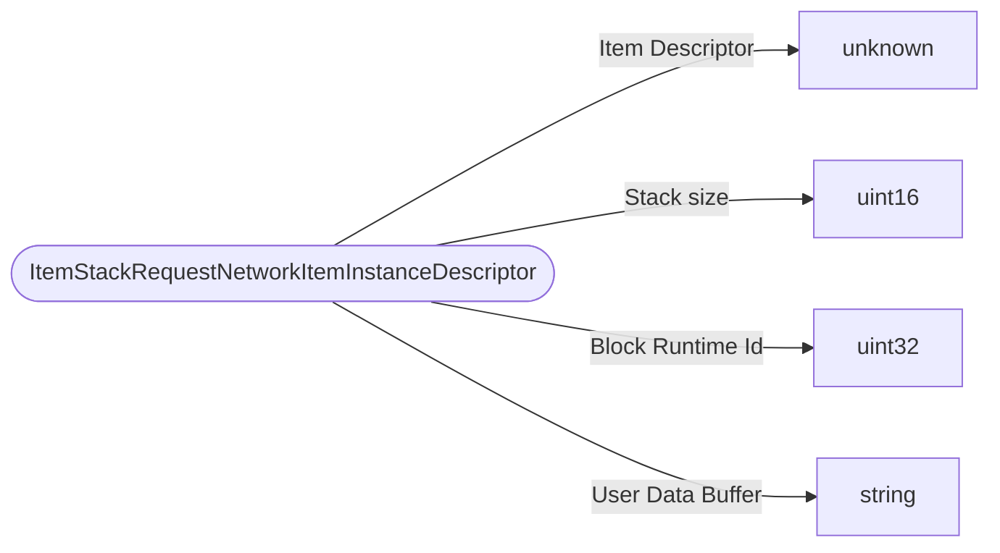

# ItemStackRequestNetworkItemInstanceDescriptor

`struct`

```mermaid
flowchart LR
  ROOT(["ItemStackRequestNetworkItemInstanceDescriptor"])
  ROOT -->|"Item Descriptor"| unknown["unknown"]
  ROOT -->|"Stack size"| uint16["uint16"]
  ROOT -->|"Block Runtime Id"| uint32["uint32"]
  ROOT -->|"User Data Buffer"| string["string"]
```

