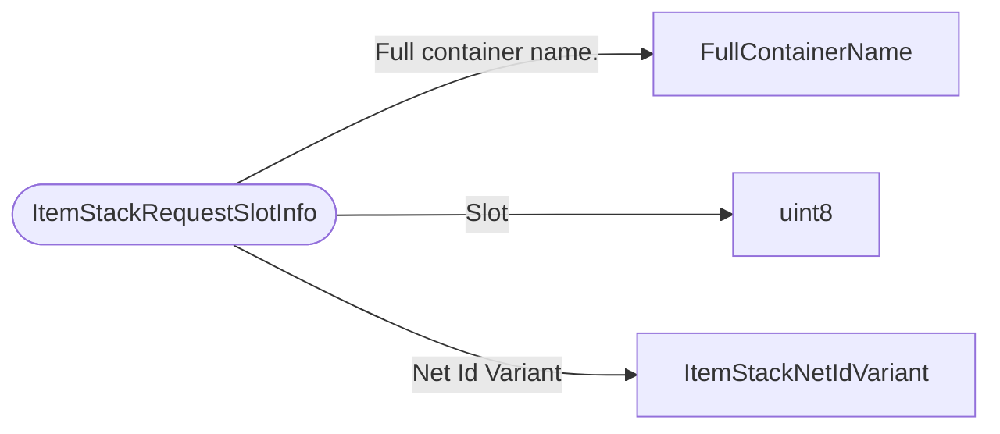

# ItemStackRequestSlotInfo

`struct`

```mermaid
flowchart LR
  ROOT(["ItemStackRequestSlotInfo"])
  ROOT -->|"Full container name."| FullContainerName["FullContainerName"]
  ROOT -->|"Slot"| uint8["uint8"]
  ROOT -->|"Net Id Variant"| ItemStackNetIdVariant["ItemStackNetIdVariant"]
```

