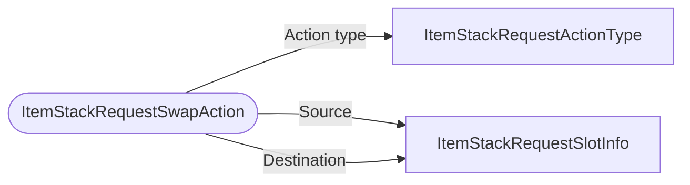

# ItemStackRequestSwapAction

`struct`

```mermaid
flowchart LR
  ROOT(["ItemStackRequestSwapAction"])
  ROOT -->|"Action type"| ItemStackRequestActionType["ItemStackRequestActionType"]
  ROOT -->|"Source"| ItemStackRequestSlotInfo["ItemStackRequestSlotInfo"]
  ROOT -->|"Destination"| ItemStackRequestSlotInfo["ItemStackRequestSlotInfo"]
```

