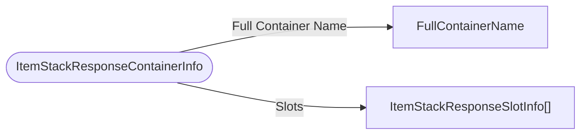

# ItemStackResponseContainerInfo

`struct`

```mermaid
flowchart LR
  ROOT(["ItemStackResponseContainerInfo"])
  ROOT -->|"Full Container Name"| FullContainerName["FullContainerName"]
  ROOT -->|"Slots"| ItemStackResponseSlotInfo["ItemStackResponseSlotInfo[]"]
```

