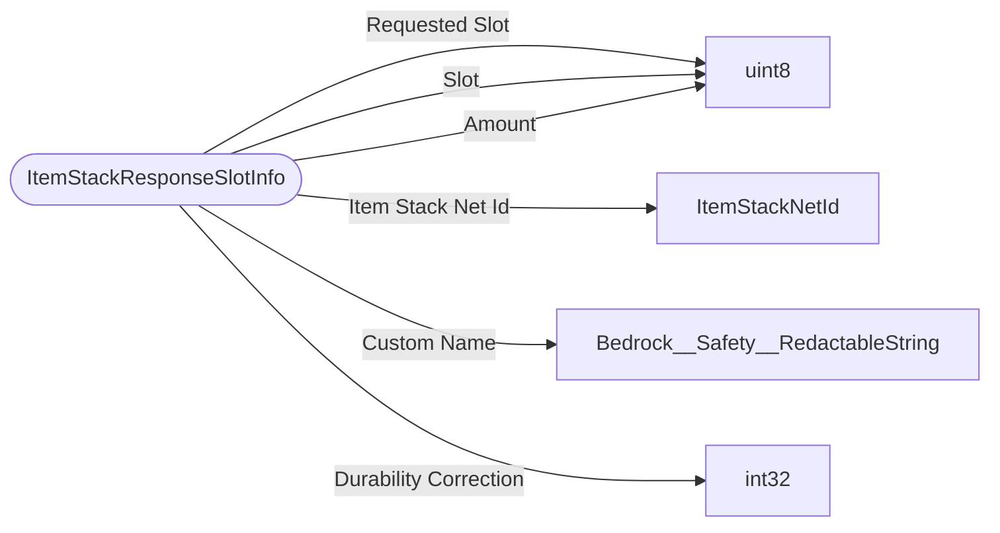

# ItemStackResponseSlotInfo

`struct`

```mermaid
flowchart LR
  ROOT(["ItemStackResponseSlotInfo"])
  ROOT -->|"Requested Slot"| uint8["uint8"]
  ROOT -->|"Slot"| uint8["uint8"]
  ROOT -->|"Amount"| uint8["uint8"]
  ROOT -->|"Item Stack Net Id"| ItemStackNetId["ItemStackNetId"]
  ROOT -->|"Custom Name"| Bedrock__Safety__RedactableString["Bedrock__Safety__RedactableString"]
  ROOT -->|"Durability Correction"| int32["int32"]
```

