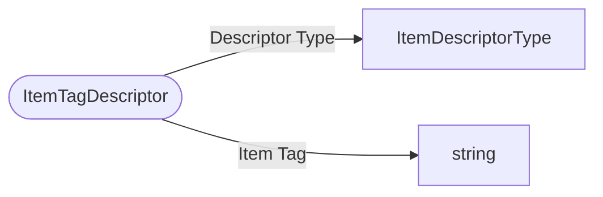

# ItemTagDescriptor

`struct`

```mermaid
flowchart LR
  ROOT(["ItemTagDescriptor"])
  ROOT -->|"Descriptor Type"| ItemDescriptorType["ItemDescriptorType"]
  ROOT -->|"Item Tag"| string["string"]
```

