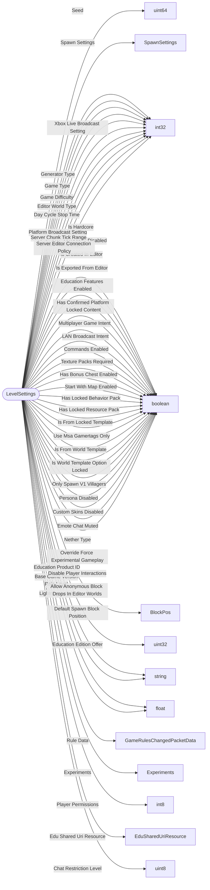

# LevelSettings

`struct`

```mermaid
flowchart LR
  ROOT(["LevelSettings"])
  ROOT -->|"Seed"| uint64["uint64"]
  ROOT -->|"Spawn Settings"| SpawnSettings["SpawnSettings"]
  ROOT -->|"Generator Type"| int32["int32"]
  ROOT -->|"Game Type"| int32["int32"]
  ROOT -->|"Is Hardcore"| boolean["boolean"]
  ROOT -->|"Game Difficulty"| int32["int32"]
  ROOT -->|"Default Spawn Block Position"| BlockPos["BlockPos"]
  ROOT -->|"Achievements Disabled"| boolean["boolean"]
  ROOT -->|"Editor World Type"| int32["int32"]
  ROOT -->|"Is Created In Editor"| boolean["boolean"]
  ROOT -->|"Is Exported From Editor"| boolean["boolean"]
  ROOT -->|"Day Cycle Stop Time"| int32["int32"]
  ROOT -->|"Education Edition Offer"| uint32["uint32"]
  ROOT -->|"Education Features Enabled"| boolean["boolean"]
  ROOT -->|"Education Product ID"| string["string"]
  ROOT -->|"Rain Level"| float["float"]
  ROOT -->|"Lightning Level"| float["float"]
  ROOT -->|"Has Confirmed Platform Locked Content"| boolean["boolean"]
  ROOT -->|"Multiplayer Game Intent"| boolean["boolean"]
  ROOT -->|"LAN Broadcast Intent"| boolean["boolean"]
  ROOT -->|"Xbox Live Broadcast Setting"| int32["int32"]
  ROOT -->|"Platform Broadcast Setting"| int32["int32"]
  ROOT -->|"Commands Enabled"| boolean["boolean"]
  ROOT -->|"Texture Packs Required"| boolean["boolean"]
  ROOT -->|"Rule Data"| GameRulesChangedPacketData["GameRulesChangedPacketData"]
  ROOT -->|"Experiments"| Experiments["Experiments"]
  ROOT -->|"Has Bonus Chest Enabled"| boolean["boolean"]
  ROOT -->|"Start With Map Enabled"| boolean["boolean"]
  ROOT -->|"Player Permissions"| int8["int8"]
  ROOT -->|"Server Chunk Tick Range"| int32["int32"]
  ROOT -->|"Has Locked Behavior Pack"| boolean["boolean"]
  ROOT -->|"Has Locked Resource Pack"| boolean["boolean"]
  ROOT -->|"Is From Locked Template"| boolean["boolean"]
  ROOT -->|"Use Msa Gamertags Only"| boolean["boolean"]
  ROOT -->|"Is From World Template"| boolean["boolean"]
  ROOT -->|"Is World Template Option Locked"| boolean["boolean"]
  ROOT -->|"Only Spawn V1 Villagers"| boolean["boolean"]
  ROOT -->|"Persona Disabled"| boolean["boolean"]
  ROOT -->|"Custom Skins Disabled"| boolean["boolean"]
  ROOT -->|"Emote Chat Muted"| boolean["boolean"]
  ROOT -->|"Base Game Version"| string["string"]
  ROOT -->|"Limited World Width"| int32["int32"]
  ROOT -->|"Limited World Depth"| int32["int32"]
  ROOT -->|"Nether Type"| boolean["boolean"]
  ROOT -->|"Edu Shared Uri Resource"| EduSharedUriResource["EduSharedUriResource"]
  ROOT -->|"Override Force Experimental Gameplay"| boolean["boolean"]
  ROOT -->|"Chat Restriction Level"| uint8["uint8"]
  ROOT -->|"Disable Player Interactions"| boolean["boolean"]
  ROOT -->|"Server Editor Connection Policy"| int32["int32"]
  ROOT -->|"Allow Anonymous Block Drops In Editor Worlds"| boolean["boolean"]
```

