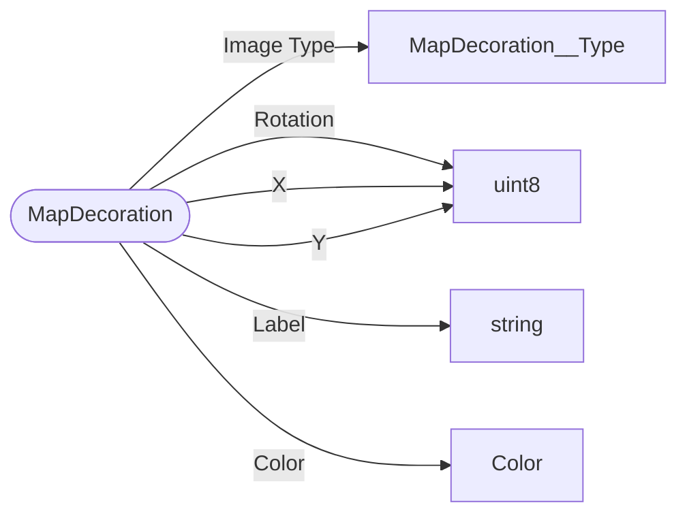

# MapDecoration

`struct`

```mermaid
flowchart LR
  ROOT(["MapDecoration"])
  ROOT -->|"Image Type"| MapDecoration__Type["MapDecoration__Type"]
  ROOT -->|"Rotation"| uint8["uint8"]
  ROOT -->|"X"| uint8["uint8"]
  ROOT -->|"Y"| uint8["uint8"]
  ROOT -->|"Label"| string["string"]
  ROOT -->|"Color"| Color["Color"]
```

