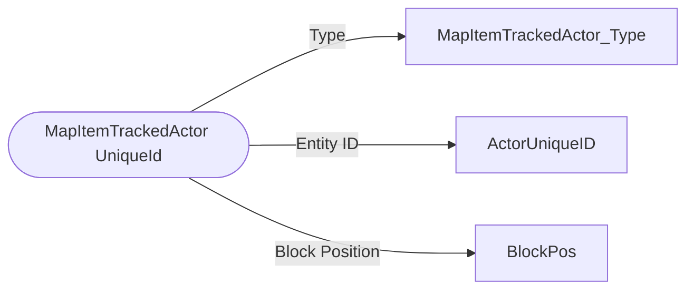

# MapItemTrackedActor UniqueId

`struct`

```mermaid
flowchart LR
  ROOT(["MapItemTrackedActor UniqueId"])
  ROOT -->|"Type"| MapItemTrackedActor_Type["MapItemTrackedActor_Type"]
  ROOT -->|"Entity ID"| ActorUniqueID["ActorUniqueID"]
  ROOT -->|"Block Position"| BlockPos["BlockPos"]
```

