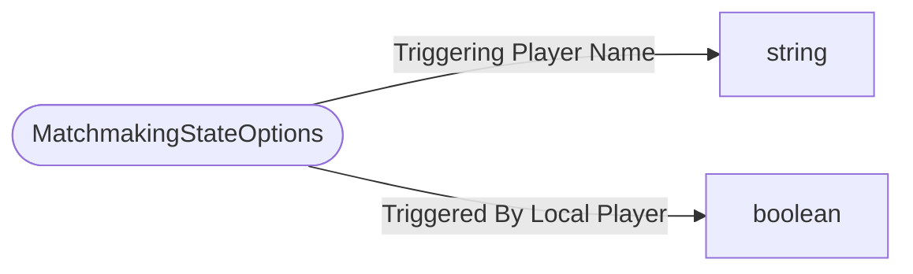

# MatchmakingStateOptions

`struct`

```mermaid
flowchart LR
  ROOT(["MatchmakingStateOptions"])
  ROOT -->|"Triggering Player Name"| string["string"]
  ROOT -->|"Triggered By Local Player"| boolean["boolean"]
```

