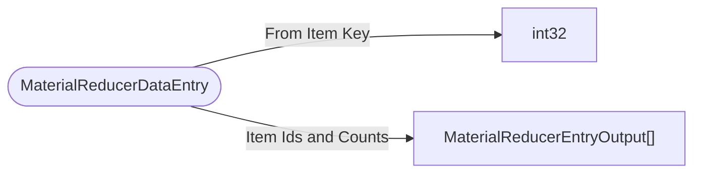

# MaterialReducerDataEntry

`struct`

```mermaid
flowchart LR
  ROOT(["MaterialReducerDataEntry"])
  ROOT -->|"From Item Key"| int32["int32"]
  ROOT -->|"Item Ids and Counts"| MaterialReducerEntryOutput["MaterialReducerEntryOutput[]"]
```

