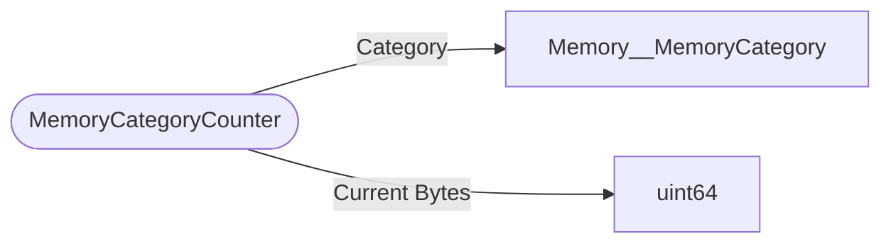

# MemoryCategoryCounter

`struct`

```mermaid
flowchart LR
  ROOT(["MemoryCategoryCounter"])
  ROOT -->|"Category"| Memory__MemoryCategory["Memory__MemoryCategory"]
  ROOT -->|"Current Bytes"| uint64["uint64"]
```

