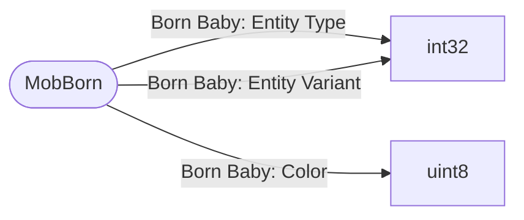

# MobBorn

`struct`

```mermaid
flowchart LR
  ROOT(["MobBorn"])
  ROOT -->|"Born Baby: Entity Type"| int32["int32"]
  ROOT -->|"Born Baby: Entity Variant"| int32["int32"]
  ROOT -->|"Born Baby: Color"| uint8["uint8"]
```

