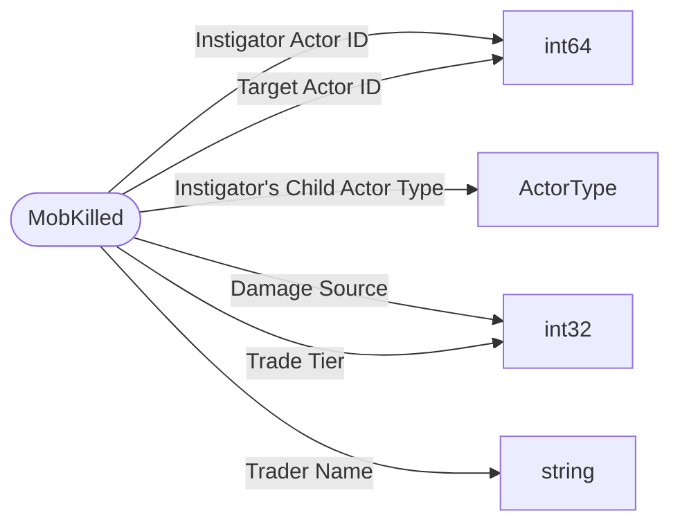

# MobKilled

`struct`

```mermaid
flowchart LR
  ROOT(["MobKilled"])
  ROOT -->|"Instigator Actor ID"| int64["int64"]
  ROOT -->|"Target Actor ID"| int64["int64"]
  ROOT -->|"Instigator's Child Actor Type"| ActorType["ActorType"]
  ROOT -->|"Damage Source"| int32["int32"]
  ROOT -->|"Trade Tier"| int32["int32"]
  ROOT -->|"Trader Name"| string["string"]
```

