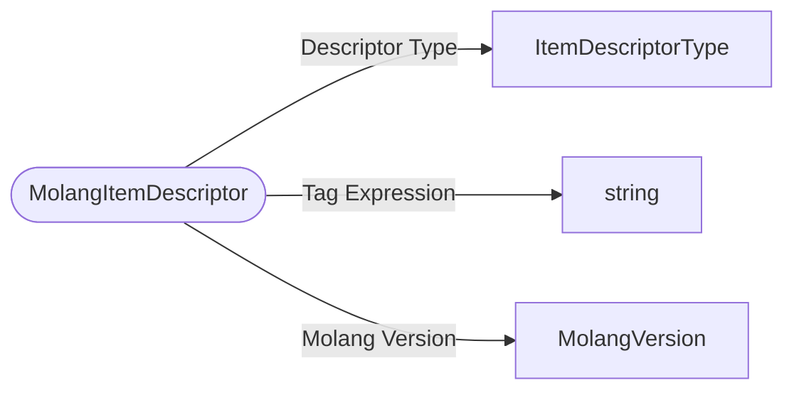

# MolangItemDescriptor

`struct`

```mermaid
flowchart LR
  ROOT(["MolangItemDescriptor"])
  ROOT -->|"Descriptor Type"| ItemDescriptorType["ItemDescriptorType"]
  ROOT -->|"Tag Expression"| string["string"]
  ROOT -->|"Molang Version"| MolangVersion["MolangVersion"]
```

