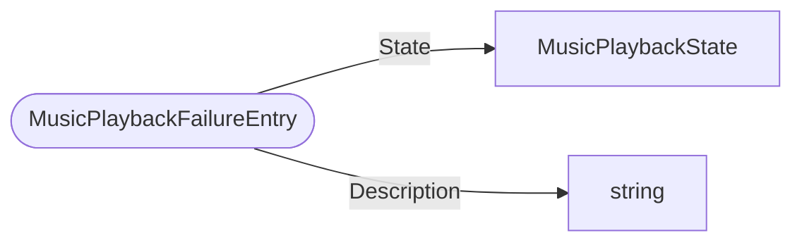

# MusicPlaybackFailureEntry

`struct`

```mermaid
flowchart LR
  ROOT(["MusicPlaybackFailureEntry"])
  ROOT -->|"State"| MusicPlaybackState["MusicPlaybackState"]
  ROOT -->|"Description"| string["string"]
```

