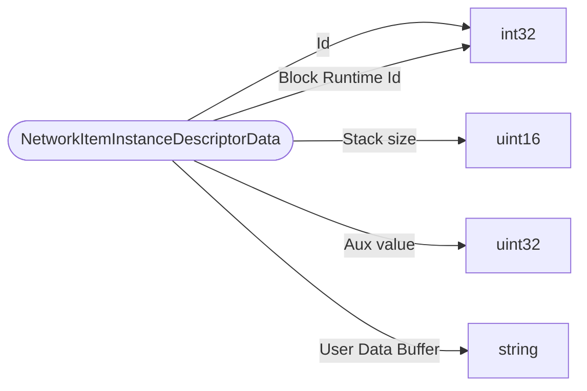

# NetworkItemInstanceDescriptorData

`struct`

```mermaid
flowchart LR
  ROOT(["NetworkItemInstanceDescriptorData"])
  ROOT -->|"Id"| int32["int32"]
  ROOT -->|"Stack size"| uint16["uint16"]
  ROOT -->|"Aux value"| uint32["uint32"]
  ROOT -->|"Block Runtime Id"| int32["int32"]
  ROOT -->|"User Data Buffer"| string["string"]
```

