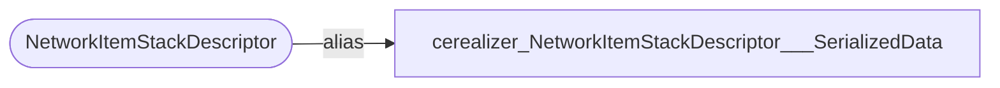

# NetworkItemStackDescriptor

`alias`

```mermaid
flowchart LR
  ROOT(["NetworkItemStackDescriptor"]) -->|alias| cerealizer_NetworkItemStackDescriptor___SerializedData["cerealizer_NetworkItemStackDescriptor___SerializedData"]
```

