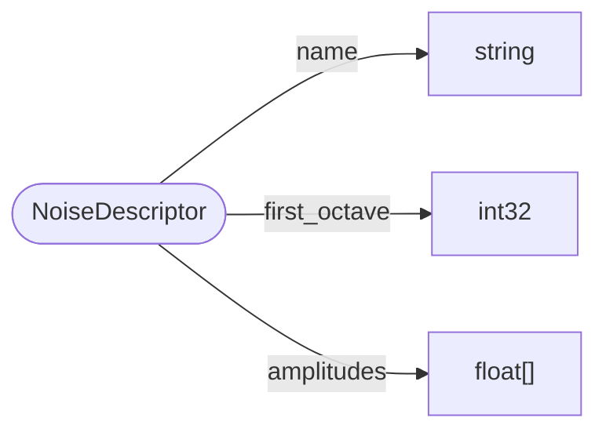

# NoiseDescriptor

`struct`

```mermaid
flowchart LR
  ROOT(["NoiseDescriptor"])
  ROOT -->|"name"| string["string"]
  ROOT -->|"first_octave"| int32["int32"]
  ROOT -->|"amplitudes"| float["float[]"]
```

