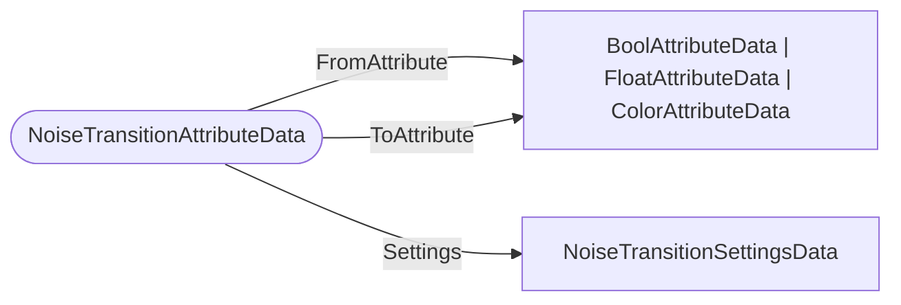

# NoiseTransitionAttributeData

`struct`

```mermaid
flowchart LR
  ROOT(["NoiseTransitionAttributeData"])
  ROOT -->|"FromAttribute"| BoolAttributeData___FloatAttributeData___ColorAttributeData["BoolAttributeData | FloatAttributeData | ColorAttributeData"]
  ROOT -->|"ToAttribute"| BoolAttributeData___FloatAttributeData___ColorAttributeData["BoolAttributeData | FloatAttributeData | ColorAttributeData"]
  ROOT -->|"Settings"| NoiseTransitionSettingsData["NoiseTransitionSettingsData"]
```

