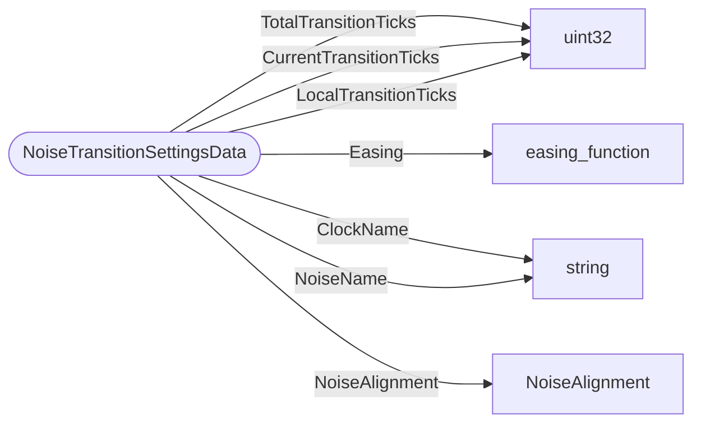

# NoiseTransitionSettingsData

`struct`

```mermaid
flowchart LR
  ROOT(["NoiseTransitionSettingsData"])
  ROOT -->|"TotalTransitionTicks"| uint32["uint32"]
  ROOT -->|"CurrentTransitionTicks"| uint32["uint32"]
  ROOT -->|"Easing"| easing_function["easing_function"]
  ROOT -->|"ClockName"| string["string"]
  ROOT -->|"LocalTransitionTicks"| uint32["uint32"]
  ROOT -->|"NoiseName"| string["string"]
  ROOT -->|"NoiseAlignment"| NoiseAlignment["NoiseAlignment"]
```

