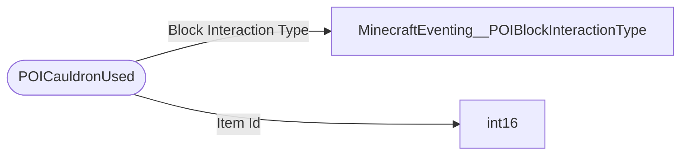

# POICauldronUsed

`struct`

```mermaid
flowchart LR
  ROOT(["POICauldronUsed"])
  ROOT -->|"Block Interaction Type"| MinecraftEventing__POIBlockInteractionType["MinecraftEventing__POIBlockInteractionType"]
  ROOT -->|"Item Id"| int16["int16"]
```

