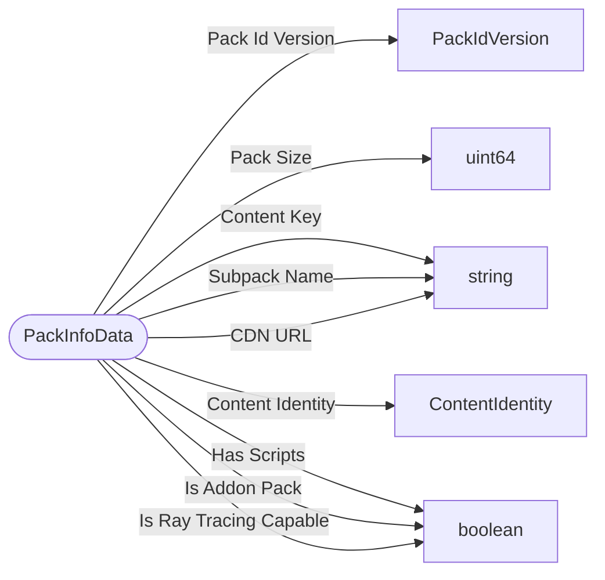

# PackInfoData

`struct`

```mermaid
flowchart LR
  ROOT(["PackInfoData"])
  ROOT -->|"Pack Id Version"| PackIdVersion["PackIdVersion"]
  ROOT -->|"Pack Size"| uint64["uint64"]
  ROOT -->|"Content Key"| string["string"]
  ROOT -->|"Subpack Name"| string["string"]
  ROOT -->|"Content Identity"| ContentIdentity["ContentIdentity"]
  ROOT -->|"Has Scripts"| boolean["boolean"]
  ROOT -->|"Is Addon Pack"| boolean["boolean"]
  ROOT -->|"Is Ray Tracing Capable"| boolean["boolean"]
  ROOT -->|"CDN URL"| string["string"]
```

