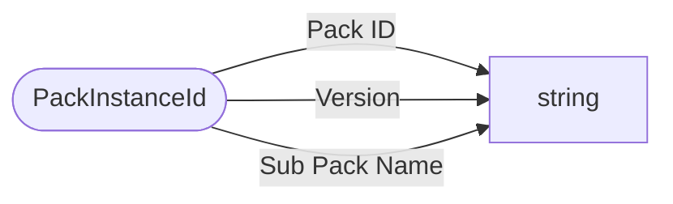

# PackInstanceId

`struct`

```mermaid
flowchart LR
  ROOT(["PackInstanceId"])
  ROOT -->|"Pack ID"| string["string"]
  ROOT -->|"Version"| string["string"]
  ROOT -->|"Sub Pack Name"| string["string"]
```

