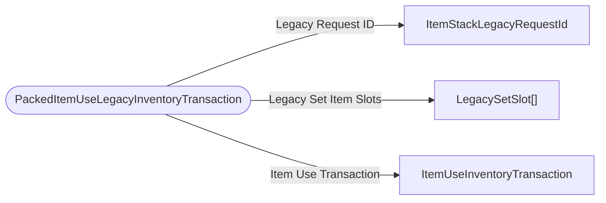

# PackedItemUseLegacyInventoryTransaction

`struct`

```mermaid
flowchart LR
  ROOT(["PackedItemUseLegacyInventoryTransaction"])
  ROOT -->|"Legacy Request ID"| ItemStackLegacyRequestId["ItemStackLegacyRequestId"]
  ROOT -->|"Legacy Set Item Slots"| LegacySetSlot["LegacySetSlot[]"]
  ROOT -->|"Item Use Transaction"| ItemUseInventoryTransaction["ItemUseInventoryTransaction"]
```

