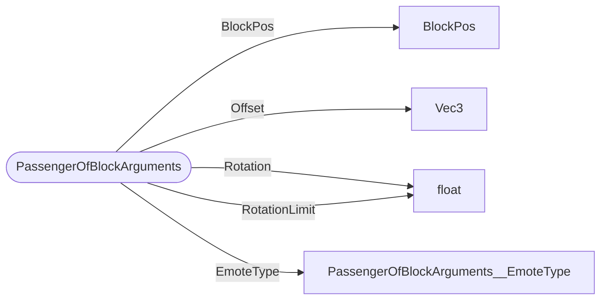

# PassengerOfBlockArguments

`struct`

```mermaid
flowchart LR
  ROOT(["PassengerOfBlockArguments"])
  ROOT -->|"BlockPos"| BlockPos["BlockPos"]
  ROOT -->|"Offset"| Vec3["Vec3"]
  ROOT -->|"Rotation"| float["float"]
  ROOT -->|"RotationLimit"| float["float"]
  ROOT -->|"EmoteType"| PassengerOfBlockArguments__EmoteType["PassengerOfBlockArguments__EmoteType"]
```

