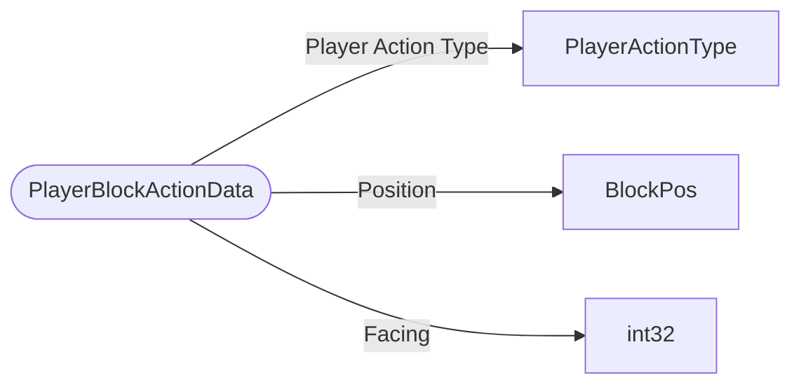

# PlayerBlockActionData

`struct`

```mermaid
flowchart LR
  ROOT(["PlayerBlockActionData"])
  ROOT -->|"Player Action Type"| PlayerActionType["PlayerActionType"]
  ROOT -->|"Position"| BlockPos["BlockPos"]
  ROOT -->|"Facing"| int32["int32"]
```

