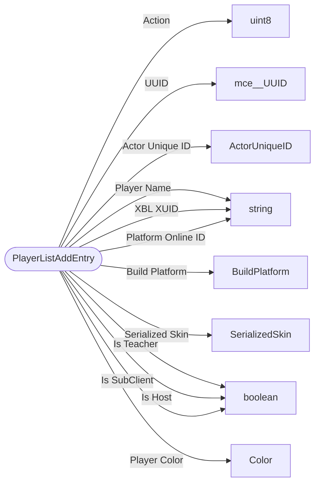

# PlayerListAddEntry

`struct`

```mermaid
flowchart LR
  ROOT(["PlayerListAddEntry"])
  ROOT -->|"Action"| uint8["uint8"]
  ROOT -->|"UUID"| mce__UUID["mce__UUID"]
  ROOT -->|"Actor Unique ID"| ActorUniqueID["ActorUniqueID"]
  ROOT -->|"Player Name"| string["string"]
  ROOT -->|"XBL XUID"| string["string"]
  ROOT -->|"Platform Online ID"| string["string"]
  ROOT -->|"Build Platform"| BuildPlatform["BuildPlatform"]
  ROOT -->|"Serialized Skin"| SerializedSkin["SerializedSkin"]
  ROOT -->|"Is Teacher"| boolean["boolean"]
  ROOT -->|"Is Host"| boolean["boolean"]
  ROOT -->|"Is SubClient"| boolean["boolean"]
  ROOT -->|"Player Color"| Color["Color"]
```

