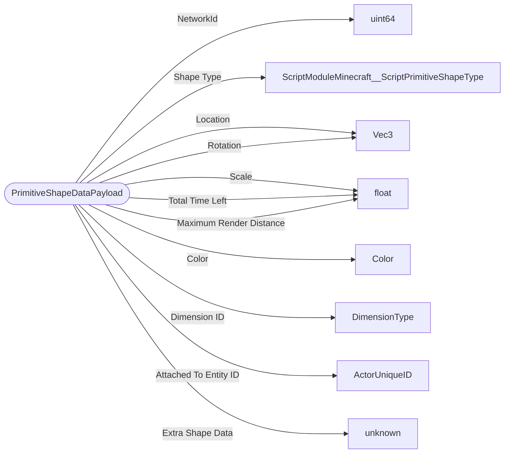

# PrimitiveShapeDataPayload

`struct`

```mermaid
flowchart LR
  ROOT(["PrimitiveShapeDataPayload"])
  ROOT -->|"NetworkId"| uint64["uint64"]
  ROOT -->|"Shape Type"| ScriptModuleMinecraft__ScriptPrimitiveShapeType["ScriptModuleMinecraft__ScriptPrimitiveShapeType"]
  ROOT -->|"Location"| Vec3["Vec3"]
  ROOT -->|"Scale"| float["float"]
  ROOT -->|"Rotation"| Vec3["Vec3"]
  ROOT -->|"Total Time Left"| float["float"]
  ROOT -->|"Maximum Render Distance"| float["float"]
  ROOT -->|"Color"| Color["Color"]
  ROOT -->|"Dimension ID"| DimensionType["DimensionType"]
  ROOT -->|"Attached To Entity ID"| ActorUniqueID["ActorUniqueID"]
  ROOT -->|"Extra Shape Data"| unknown["unknown"]
```

