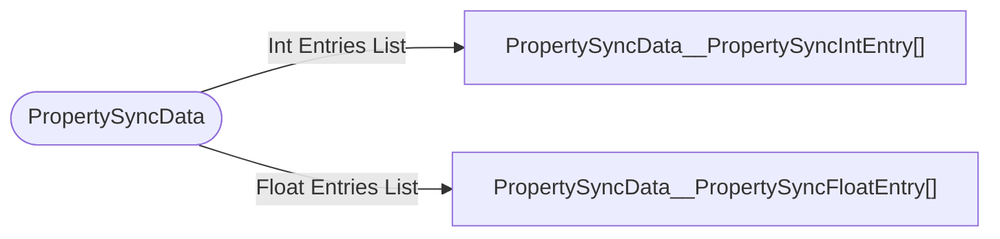

# PropertySyncData

`struct`

```mermaid
flowchart LR
  ROOT(["PropertySyncData"])
  ROOT -->|"Int Entries List"| PropertySyncData__PropertySyncIntEntry["PropertySyncData__PropertySyncIntEntry[]"]
  ROOT -->|"Float Entries List"| PropertySyncData__PropertySyncFloatEntry["PropertySyncData__PropertySyncFloatEntry[]"]
```

