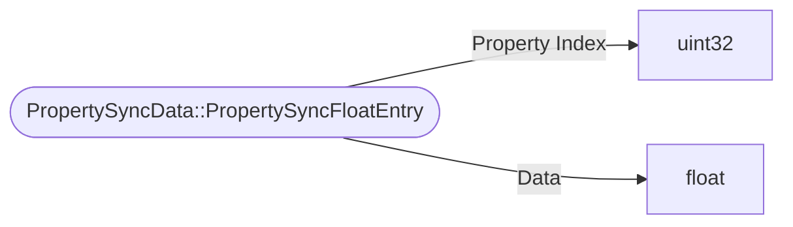

# PropertySyncData::PropertySyncFloatEntry

`struct`

```mermaid
flowchart LR
  ROOT(["PropertySyncData::PropertySyncFloatEntry"])
  ROOT -->|"Property Index"| uint32["uint32"]
  ROOT -->|"Data"| float["float"]
```

