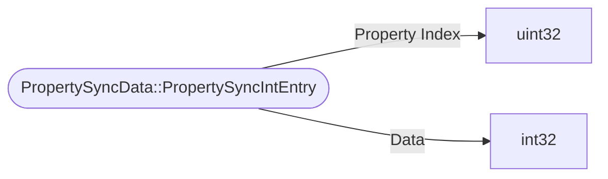

# PropertySyncData::PropertySyncIntEntry

`struct`

```mermaid
flowchart LR
  ROOT(["PropertySyncData::PropertySyncIntEntry"])
  ROOT -->|"Property Index"| uint32["uint32"]
  ROOT -->|"Data"| int32["int32"]
```

