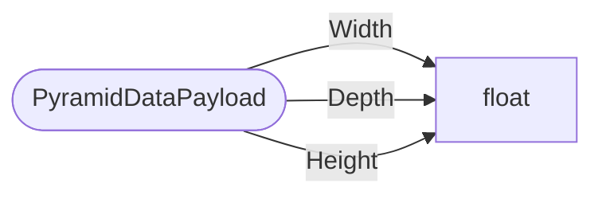

# PyramidDataPayload

`struct`

```mermaid
flowchart LR
  ROOT(["PyramidDataPayload"])
  ROOT -->|"Width"| float["float"]
  ROOT -->|"Depth"| float["float"]
  ROOT -->|"Height"| float["float"]
```

