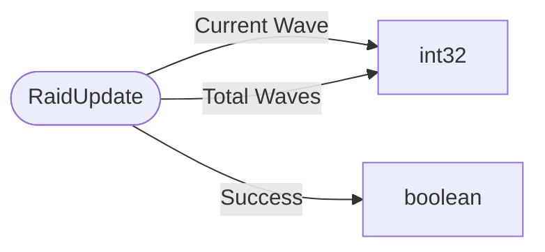

# RaidUpdate

`struct`

```mermaid
flowchart LR
  ROOT(["RaidUpdate"])
  ROOT -->|"Current Wave"| int32["int32"]
  ROOT -->|"Total Waves"| int32["int32"]
  ROOT -->|"Success"| boolean["boolean"]
```

