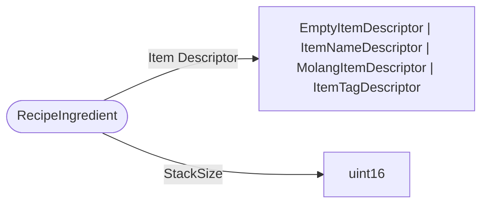

# RecipeIngredient

`struct`

```mermaid
flowchart LR
  ROOT(["RecipeIngredient"])
  ROOT -->|"Item Descriptor"| EmptyItemDescriptor___ItemNameDescriptor___MolangItemDescriptor___ItemTagDescriptor["EmptyItemDescriptor | ItemNameDescriptor | MolangItemDescriptor | ItemTagDescriptor"]
  ROOT -->|"StackSize"| uint16["uint16"]
```

